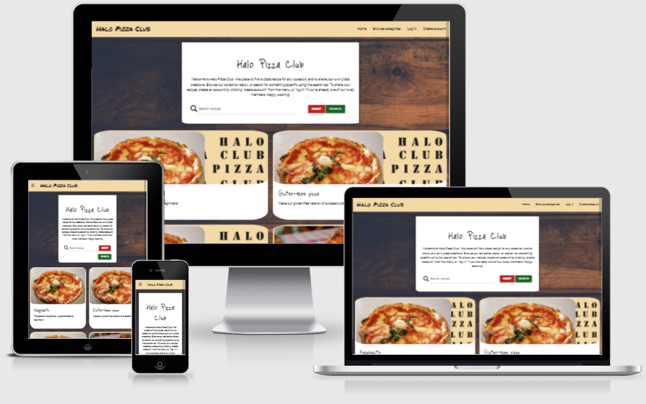
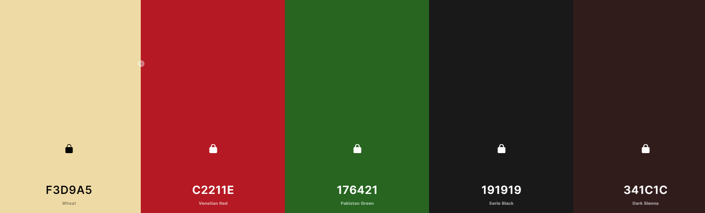
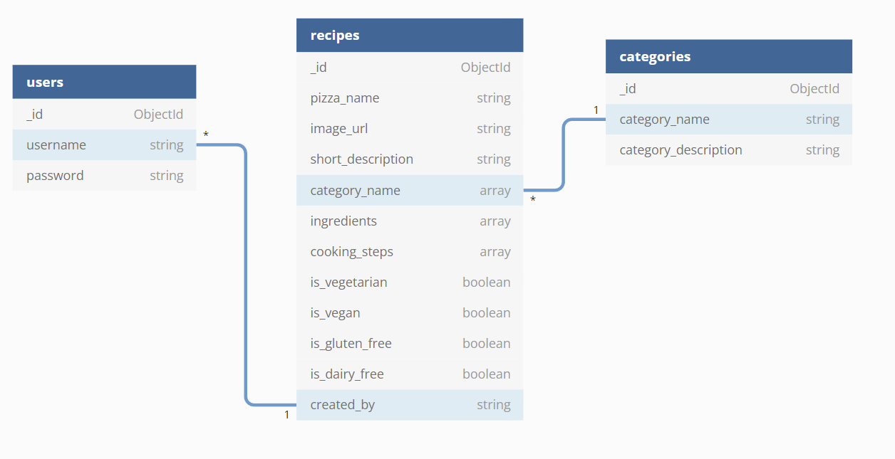
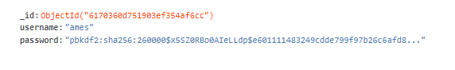
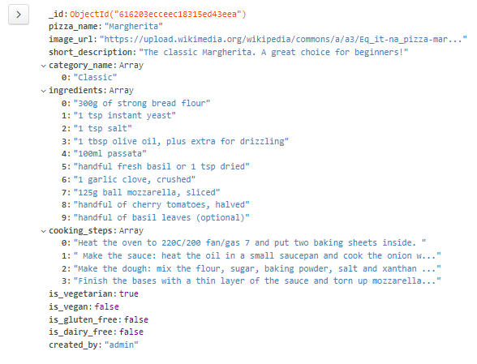
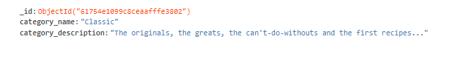

# Halo Pizza



The live site for the Halo Pizza Club can  be found [here](https://ms3-halo-pizza.herokuapp.com/).

# Project overview
This website serves to provide a space where users can log in to share their pizza recipes, view other users' submitted recipes, and edit recipes they have submitted. The site requires users to log in to submit and edit recipes, and features authentication to securely facilitate this. A visitor to the site will be visiting for one of two basic reasons: to find information on pizza recipes or to share it. The functions of the site facilitate this. The owner of the site will have similar goals, but with a slight lean towards curation of these recipes. To this end, a site owner will have control of the categorisation of recipes and the ability to edit those of other users if necessary.

---

# Table of contents

* [Project overview](https://github.com/James-VT/MS3_Halo_Pizza#project-overview)

* [UX](https://github.com/James-VT/MS3_Halo_Pizza#ux)
    * [User stories](https://github.com/James-VT/MS3_Halo_Pizza#user-stories)

* [Design](https://github.com/James-VT/MS3_Halo_Pizza#design)
    * [Colour palette](https://github.com/James-VT/MS3_Halo_Pizza#colour-palette)
    * [Wireframes](https://github.com/James-VT/MS3_Halo_Pizza#wireframes)
    * [Database](https://github.com/James-VT/MS3_Halo_Pizza#database)

* [Testing](https://github.com/James-VT/MS3_Halo_Pizza#testing)

* [Deployment](https://github.com/James-VT/MS3_Halo_Pizza#deployment)

* [Credits](https://github.com/James-VT/MS3_Halo_Pizza#credits)
    * [Technologies used](https://github.com/James-VT/MS3_Halo_Pizza#technologies-used)

* [Tutorials](https://github.com/James-VT/MS3_Halo_Pizza#tutorials)

* [Content](https://github.com/James-VT/MS3_Halo_Pizza#content)

* [Images](https://github.com/James-VT/MS3_Halo_Pizza#images)

* [External libraries](https://github.com/James-VT/MS3_Halo_Pizza#external-libraries)

* [Individual credits](https://github.com/James-VT/MS3_Halo_Pizza#individual-credits)


# UX

The main aim of the site is the manipulation of database data - Create, Read, Update, Delete (CRUD for short) - all relating to the subject of pizza. The user experience is geared towards this, with all functions aimed at implementing or supporting these functions.

## User stories
### A visitor to the site will want to:
1. Browse pizza recipes and ideas.
2. Upload their own recipes for others to see.
3. Edit their submitted recipes.
4. Delete their submitted recipes.
5. Register with the site to submit and edit recipes.
6. View recipes without having to register for the site or log in.

### A site owner will want to:
7. Receive on-screen confirmation that my creations, editions and deletions have been successful, and for the visitors are also receiving these where appropriate.
8. Create recipe categories to group recipes.
9. Edit recipe categories.
10. Delete recipe categories.
11. Allow users to log in so they can submit recipes, hopefully encouraging return visits.
12. Edit and delete users' recipes if required.
13. Restrict access to certain features to be solely for the site admin.

---

## Design

An outline of design choices on front and back end follows.

## Colour palette

The colour palette for this project was generated using Coolors (credited in the Technologies Used section below).



### Wheat, Venetian Red, Pakistan Green:
These three were chosen to loosely resemble colours associated with pizza. Although they aren't exact matches for pizza dough, passata or green peppers I've chosen them as much for contrast and continuity with each other as I have for accuracy.

### Eerie Black:
This will be our font colour, though where necessity dictates default black can be used, particularly if displaying text over the last colour.

### Dark Sienna:
Dark Sienna will be our back-up colour, and a bit of a wildcard option. Coolors suggested it as an accompaniment for the other four, and as it loosely fits the pizza theme, I include it here as a potential element.

---

## Wireframes

Wireframes for this project were created using Balsamiq. All images linked below contain wireframes for mobile, tablet and desktop views.

| Page | Wireframe |
|---|---|
| Home page | [Homepage all screens](static/images/wireframes/homepage.png) |
| Log in/register page | [Log in and register pages all screens](static/images/wireframes/loginregisterpage.png) |
| Category selection page | [Catergory selection page all screens](static/images/wireframes/categorypage.png) |
| Error pages | [Error pages all screens](static/images/wireframes/errorpagesms3.png) |
| Recipe pages | [Recipe pages all screens](static/images/wireframes/recipeviewms3.png) |
| User submitted recipe page | [User's own recipes page all screens](static/images/wireframes/userrecipesms3.png) |
| Edit and submit recipe page | [Form for submitting and editing recipes all screens](static/images/wireframes/submiteditrecipems3.png) |
| View recipes by category page | [Category recipes page all screens](static/images/wireframes/viewbycategorypagems3.png) |

---

## Database

Below is the physical database model of this project:



The database itself is a non-relational, NoSQL database, held on MongoDB. You can see the data types of everything stored in it, and the links point to how the relationships work. For example, when a user creates a recipe, their username is recorded and stored in the "created_by" field. That way ownership can be restricted to one person, and this person is the only user who can edit and delete that recipe other than the site administrator. Likewise, the category chosen by the user is also recorded so that visitors who wish to view recipes in a particular category will find it there. (Note that users are not required to choose a category, merely recommended to do so. The reason for this is that all recipes can be viewed and searched for regardless of whether a category is chosen, and some users may not feel their recipe falls into any of the available categories.)

Some code below demonstrates how this works:

```
@app.route("/register", methods=["GET", "POST"])
def register():
    if request.method == "POST":
        existing_user = mongo.db.users.find_one(
            {"username": request.form.get("username").lower()})

        if existing_user:
            flash("Username already exists")
            return redirect(url_for("register"))

        register = {
            "username": request.form.get("username").lower(),
            "password": generate_password_hash(
                request.form.get("password"))
            }
        mongo.db.users.insert_one(register)

        session["user"] = request.form.get("username").lower()
        flash("Congratulations, you have successfully created your account!")
        return redirect(url_for("account", username=session["user"]))
    return render_template("register.html")
```

The above code handles the registration functionality. You can see how the username entered by the aspiring user is checked against what exists in the database already to avoid duplicates. This is important, as the username itself is what is used to mark ownership of each recipe instead of, for example, the ObjectId. Here's an example of what's created by this code in the database:



So when a user has joined up, they can submit a recipe. How does that look vis-a-vis our database? First, observe the code below that makes the upload happen:

```
@app.route("/add_recipe", methods=["GET", "POST"])
def add_recipe():
    if request.method == "POST":
        is_vegetarian = True if request.form.get(
            "is_vegetarian") else False
        is_vegan = True if request.form.get(
            "is_vegan") else False
        is_gluten_free = True if request.form.get(
            "is_gluten_free") else False
        is_dairy_free = True if request.form.get(
            "is_dairy_free") else False
        recipe = {
            "pizza_name": request.form.get("pizza_name"),
            "image_url": request.form.get("image_url"),
            "short_description": request.form.get("short_description"),
            "category_name": request.form.getlist("category_name"),
            "ingredients": request.form.getlist("ingredients"),
            "cooking_steps": request.form.getlist("cooking_steps"),
            "is_vegetarian": is_vegetarian,
            "is_vegan": is_vegan,
            "is_gluten_free": is_gluten_free,
            "is_dairy_free": is_dairy_free,
            "created_by": session["user"]
        }
        mongo.db.recipes.insert_one(recipe)
        flash("Thank you for submitting your recipe!")
        return redirect(url_for("get_recipes"))

    categories = mongo.db.categories.find().sort("category_name", 1)
    return render_template("add_recipe.html", categories=categories)
```

And below, the resultant entry in our recipes collection:



As mentioned, the thing that is recorded to determine ownership of the recipe is the username - in this case, swagged from the session cookie. The categories chosen by a user are recorded, and these are stored as an array within the recipes collection, as seen in our diagram above. These are stored as an array as the user may choose more than one, but each exists within its own entry in the categories cluster, complete with their own description. That brings us to how the categories are used.

```
@app.route("/get_categories")
def get_categories():
    categories = list(mongo.db.categories.find().sort("category_name", 1))
    return render_template("categories.html", categories=categories)
```

The code to generate our page that allows a user to browse recipes by category is simple. Each option on the page is generated by what's in the collection, and it displays their short_description value. Then when a user clicks to view a category, only the recipes with the category on which they clicked are displayed. Below is an example from that database:



---

# Testing

* The testing section, being on the large side, is in a separate file, [here](testing.md).

---

# Deployment
 Here I'll explain how to deploy/how I deployed the website to GitHub and how to run it locally. 

## Deploying a static project to GitHub pages:
 1. You'll need a GitHub account, if you don't already have one. Head to their site https://github.com and you'll see the sign-up links straightaway on the home page. Google Chrome is the recommended browser for GitHub.
 2. Once you're signed-up, this'll be your landing page.
 3. Click on the user icon in the top right corner of the screen. This opens a dropdown menu. Click "Your repositories."
 4. You'll then see a list of your repositories.
 5. In the list of repositories, click the repository you want - in this case, Halo Pizza.
 6. Then, from the bar along the top (not the nav bar - lower, under the repo name) click Settings.
 7. On the Settings page, click "Pages" from the left-hand menu.
 8. In the Pages options, before you've deployed, your "Branch" under "Source" will have a default value of none. Click this, then set it to Main or Master depending on the version you're using. Mine, having been already deployed, says Master and yours will too when deployed, but ignore that discrepancy for now.
 9. Click Save.
 10. The page will refresh, and you'll see it change to say "Your site is ready to be deployed at "https://username.github.io/repository-name/"
 11. Be aware this deployed site will take a few minutes to deploy, usually about ten. Be patient and don't click while it's building as that can slow it down.
 12. Click the link to make sure it works after a suitable wait. Et voila, you've deployed the site!

### Forking the repository for your own use
This creates a copy of the repository for editing or viewing without affecting my (original) version. If you want to do it, do this:
1. You'll need a GitHub account. Go to https://github.com to make one.
2. Locate the repository (this one). At the top right of the page, beneath my pink and white avatar, you'll see the Fork button. Click it.
3. This should add a version for you to use in your own repository. Have fun with it!

### Cloning the repository
Another way of getting your own local version to work on is to clone the repository. Below are the steps.
1. You'll need a GitHub account. Go to https://github.com to make one.
2. Locate the repository (this one).
3. Click Code, the button just to the left of the green GitPod button.
4. Click HTTPS to make sure you're in it, then copy the link you see there.
6. Head into GitPod or your IDE of choice, and open Git Bash.
7. The current working directory needs to be changed to the location you want the cloned one to be.
8. In the CLI, type "git clone" and then the URL you copied earlier.
9. Press enter. Result!

Don't forget you'll need your own env.py file with your own variables and a MongoDB database to matcbh the one we have above. You'll also need to use something like pip install -r requirements.txt to install all of the required packages from out of the requirements file.

## Deploying to Heroku:
Heroku allows us to host Python projects, instead of merely static sites which are all GitHub allows.
### Create your Heroku app
1. Make an account with Heroku, if you don't already have one, here: https://www.heroku.com/
2. After setting your password and/or logging in, you'll find yourself looking at the Heroku dashboard.
3. You can click your chosen development language for some helpful tips and tutorials about how to use it with Heroku, if that'd help you.
4. From the dashboard, click "Create new app."
5. Enter a name for your app. It must be unique, and contain only letters, numbers and hyphens.
6. Choose a region. In our case, Europe.
7. Click "Create app."

### Connect your Git repository to Heroku
1. You now want to find the "deploy" tab at the top of the screen.
2. You want to find "Deployment method" and "GitHub" from in there.
3. In the search bar, find your GitHub repo.
4. On the correct repo, click "Connect." DO NOT click to "Enable Automatic Deployment" at this stage. Tried it. Can't recommend.

### Create your "requirements.txt" file
1. Heroku uses this to detect which language we're using, and our dependencies.
2. The way to create the requirements.txt file is to type, in the console: pip3 freeze --local > requirements.txt
3. Wait for Heroku to install what it needs. After this, it will now be deployed to Heroku, but if you try to open it there now, you'll see an error. There's one more thing to do.

### Create your Heroku "Procfile"
1. A Procfile is a specific file Heroku needs in order to know how to run our project.
2. To create it, redirect an echo command by typing "echo web: python run.py > Procfile". The capital P is crucial.
3. git add this, commit it, and finally git push it.
4. Well done!

### Set up your env.py file for your environment variables.
1. Make sure you create a .gitignore file if you haven't already, and add the file you'll use for your environment variables into it.
2. The convention for the file holding your environment variables is env.py
3. In env.py, you can place your IP, PORT, any secret keys etc.
4. Crucially, you can also set up the links between your project and MongoDB here as well, by adding the key-value pairs to connect to your Mongo database. Make sure you've installed flask-pymongo and dnspython to allow your Flask application to work with MongoDB.

### Enter your environment variables into Heroku's config vars.
1. On your project's Heroku page, go to settings and scroll down to "config vars"
2. Here you can add the information in your env.py file to your Heroku project. The reason you need to do this is that your env.py file, which is listed in your .gitignore, is not pushed to Heroku or GitHub. As such, Heroku does not have access to the information contained within it, which is vital to the running of the project.
3. Add those environment variables in config vars as key-value pairs.
4. Remember that "Enable Automatic Deployment" thing I told you not to click? Click it now.
5. Beneath there, find "Manual Deploy," choose the master branch and click "Deploy Branch."
4. You should now be able to open your project via the "Open app" button.

---

## Credits

### Technologies used

* Languages:
    * [HTML5](https://en.wikipedia.org/wiki/HTML5) was used for the content and structure of the site.
    * [CSS3](https://en.wikipedia.org/wiki/CSS#CSS_3) was used for the styling of the site.
    * [JavaScript](https://en.wikipedia.org/wiki/JavaScript) was used for the interactivity of the site.
    * [Python](https://www.python.org/) was used for the back end programming of the site.

* [Flask](https://flask.palletsprojects.com/en/2.0.x/)
    * Flask was used to handle the templating for the site.

* [Flask-PyMongo](https://pypi.org/project/Flask-PyMongo/)
    * Flask-PyMongo provides MongoDB support for Flask applications.

* [pip](https://pip.pypa.io/en/stable/)
    * Pip is the package installer for Python, allowing us to install the packages we need for this site.

* [dnspython](https://www.dnspython.org/)
    * Dnspython is a DNS toolkit for python.

* [FlaskPaginate](https://pythonhosted.org/Flask-paginate/)
    * FlaskPaginate has provided our extension for pagination.

* [Werkezeug](https://wsgi.readthedocs.io/en/latest/what.html)
    * Werkzeug is a Web Server Gateway Interface web application library.

* [Jinja](https://www.palletsprojects.com/p/jinja/)
    * Jinja is a templating engine for Python, used to write Flask and other templating services.

* [Balsamiq](https://balsamiq.com/)
    * Balsamiq was used to create the wireframes for this project. 

* [Git](https://git-scm.com/)
    * Git was used for version control and saving work in the repository, using the GitPod extension in Google Chrome to commit to GitHub.

* [Chrome](https://www.google.com/intl/en_uk/chrome/)
    * This project was created in the Google Chrome browser, and as such Chrome was used as the default testing browser.

* [Google Fonts](https://fonts.google.com/)
    * The fonts for the site were imported from Google Fonts. This site uses Roboto and Just Me Again Down Here throughout.

* [FontAwesome](https://fontawesome.com/)
    * The icons for social media links were taken from FontAwesome.

* [Coolors](https://coolors.co/)
    * The colour palette for this site was chosen using Coolors.

* [RandomKeygen](https://randomkeygen.com/)
    * RandomKeygen is a free online service for generating passwords with optional levels of security, and was used in this project to generate a password for our environment variables.

* [Spark Adobe](https://spark.adobe.com/sp/)
    * Spark Adobe is a fremium online service for creating graphics and images. I have used it for the creation of the pizzacardbackground.png image.

* [Heroku](https://devcenter.heroku.com/)
    * Heroku is where we deploy this live site.

* [MongoDB](https://www.mongodb.com/)
    * MongoDB is where we host our NoSQL database.

* [GitHub](https://github.com/)
    * GitHub is where we host our site.

* [Lighthouse](https://developers.google.com/web/tools/lighthouse)
    * Lighthouse assesses our pages for accessibility, performance and other things.

* [Jigsaw](https://jigsaw.w3.org/css-validator/)
    * Jigsaw validates our CSS for best practices.

* [JSHint](jshint.com)
    * JSHint assesses our Javascript for being practices, bugs, and syntax errors.

* [PEP8 Online](http://pep8online.com/)
    * PEP8 Online checks for errors in out Python code.

* [Am I Responsive?](http://ami.responsivedesign.is/#)
    * This is where we created the header image for this README.

* [favicon](favicon.io)
    * Favicon was used to creat the site's favicon.

* [Autoprefixer](https://autoprefixer.github.io/)
    * Autoprefixer was used to generate necessary prefixes to ensure site styling remains consistent across browsers.


### Tutorials
* Code Institute's Task Manager walkthrough project
    * Much of the basic functionality, in particular the authentication and the basic functionality, are sourced from Code Institute's back end walkthrough project. Much of what's in Halo Pizzas' run.py file is adapted from that Task Manager app. While a lot of what's sourced are simple standard Flask conventions, this project owes a large debt to that one.

* Dynamic Form Fields Javascript | Add & Remove https://www.youtube.com/watch?v=MLBLsxcB3Dc
    * This video helped a lot with some of the form elements, in particular the creation of new fields for adding and removing ingredients.

* Border styling
    * Much of the code for border-style and card-style was taken from https://codepen.io/piccalilli/pen/MPLzay. I've marked in the code where it was originally placed, but bits of it have been spliced and cannibalised for use elsewhere in the stylesheet so I include it here as a catch-all.

* Delete user
    * Although created for SQL, the video https://www.youtube.com/watch?v=w_VHabMAM1c was good at understanding what was required when deleting a user.

---

## Content

Most recipes are taken from [BBC Good Food](https://www.bbcgoodfood.com/). Others are taken from [Tasty.co](https://tasty.co/), [Wikimedia Commons](https://commons.wikimedia.org/wiki/Main_Page).

---

## Images

https://upload.wikimedia.org/wikipedia/commons/d/d9/Pizza_18.jpg is from Wikimedia Commons, attribution: Kurt Kaiser, CC0, via Wikimedia Commons

https://upload.wikimedia.org/wikipedia/commons/a/a3/Eq_it-na_pizza-margherita_sep2005_sml.jpg is from Wikimedia Commons, attribution: Valerio Capello at English Wikipedia, CC BY-SA 3.0 <http://creativecommons.org/licenses/by-sa/3.0/>, via Wikimedia Commons

https://upload.wikimedia.org/wikipedia/commons/4/4c/Mega_calzone_-_ND0_3598_%288041009503%29.jpg is from Wikimedia Commons, attribution: N i c o l a from Fiumicino (Rome), Italy, CC BY 2.0 <https://creativecommons.org/licenses/by/2.0>, via Wikimedia Commons

---

## External libraries

* [JQuery](https://jquery.com/download/#using-jquery-with-a-cdn)
    * JQuery is used in this project via CDN to provide the option of simplifying JavaScript code.
* Why JQuery?
    * The benefit of JQuery is that it allows a developer to use JavaScript functionality without the verbosity of writing pure JavaScript.

* [Materialize](https://materializecss.com/)
    * Materialize was used for some HTML component templates and CSS styling.
* Why Materialize?
    * Materialize provides out-of-the-box features which make certain commonly-found features of web design quick and easy.

## Individual credits

During work on this project I had the misfortune to lose the workspace to a glitch the good folks at Gitpod never truly explained, but they sent me a downloadable version of the workspace. Huge thanks to Alan, tutor at Code Institute, and fellow students SuzyBee and Scott Böning for their patient assistance and encouragement at getting my project back up and running. And a big thank you to Andriy Saltanchuk, fellow student, for his suggestion of the "if session["user"]==admin:" code used to restrict page access to admins. Large thanks must also go to Slack channel leads former and current Amy O'Shea and Melinda Zhang - the former for her terrific webinar on how to plan for MS3 and some great examples of ideas and implementations, and the latter for being on hand in the channel for questions. A tremendous thank you goes also to my mentor Mo Shami for his help and guidance throughout.