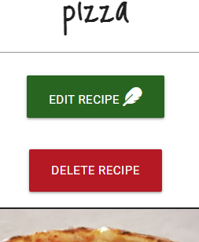

# Testing

## Initial test to ensure this Flask project is correctly set up
To ensure I had the run.py ready to go, I tried to run a simple "Hello, world!" in a browser window. My code, following the instructions from Flask's official documentation and Code Institute's tutorials, looked like this:
```import os
from flask import Flask


app = Flask(__name__)


@app.route("/")
def index():
    return "Hello, world!"


if __name__ == "__main__":
    app.run(
        host=os.environ.get("IP", "0.0.0.0"),
        port=int(os.environ.get("PORT", "5000")),
        debug=True
    )
```

Upon opening the port in the CLI, I'm pleased to say the following browser window opened:


---

## Test to ensure the project is connected to MongoDB:
In order to ascertain whether I had properly connected to my MongoDB database for this project, I followed Code Institute's tutorial. My code in run.py looked like this for the function to render the template:

```@app.route("/")
@app.route("/get_recipes")
def get_recipes():
    recipes = mongo.db.recipes.find()
    return render_template("home.html", recipes=recipes)
```

In my home.html file, I had this:
```
    
        {{ recipe.pizza_name }}<br>
        {{ recipe.category_name }}<br>
        {{ recipe.ingredients }}<br>
        {{ recipe.method }}<br>
        <br>
    
```

Upon opening the project in the console, the page that loaded looked like this:


Success!

---

# Feature testing

In this section I shall test the features of the site to ensure they themselves work, and I shall also test these against the user stories to demonstrate which user stories are fulfilled by the existence of these features.

## CRUD functionality

* A big part of this project was the successful implementation of CRUD functionality - create, read, update, delete. I shall start by testing these.

### Create

* A user of this site can upload their recipes for other users and visitors to view, fulfilling the "create" aspect of CRUD. The top of the upload form can be seen below:


To test whether the form is acting as it should, we can enter some dummy information and check for it in the database after we've submitted it. Filling in and submitting the form allows us to test a couple of other features at the same time:

1. Add and delete ingredient and cooking step buttons

The form provides functionality for a user to add ingredients for their recipes. One field for this is presented when a user first loads the form page. Beneath this sit two buttons: an "add ingredient" button, and a "delete ingredient" button. A user can click the "add ingredient" button to add an extra ingredient, and do this for all the ingredients they need. Underneath this, the same is true of the "cooking step" field - buttons are present to both add and remove fields for this.


And here we can see it again, with more fields added via button clicks:


And this time, with fields removed via the delete buttons:


The buttons are working fine.

Returning to the form itself, here we have the bottom half of the form. I have now added some dummy data to the form to allow us to test whether it transfers properly to the database. Note that for the image URL field, the form autofills with the data seen here, which links to a generic open-source picture of a pizza from Wikimedia Commons. This is so that a user without a picture for their recipe can be provided with one. Observe the new types of field. We have categories in two forms; one category field is a drop-down menu, and the other exists as a series of checkboxes represented as sliders via a Materialize feature.


We can select items from within the dropdown menu in order to select into which categories each recipe will belong. I could have rolled these in with the Boolean checkboxes below, but as they are slightly more broad in the way the categories work (and person's idea of spicy is not the same as another's, for example; and what defines classic or adventurous is debatable) I have decided to treat these categories differently, allowing them to stand out for content creators as being more relative in terms of how they'd be categorised, as opposed to the attributes mentioned in the sliders which are easily labelled as being true or false. In this case, I have selected only "classic."


Beneath the categories, we have the sliders. This is for the person uploading the recipe to be able to relay to a user whether their pizzas are any of the things listed in the image, as these will naturally be pertinent for a user to know. As these are things which run on simple Boolean values, checkboxes seemed the natural way to go.


We're all set. All that remains now is to click SUBMIT, and then we'll check the database in MongoDB to ensure everything has submitted correctly. This gives us an opportunity to check one other small thing:

2. Flash messages

Upon submitting the recipe, users are returned to the home page and presented with the following flash message:


Great! We know from this that our flash message is working correctly.

And now, over to the database on MongoDB.

3. MongoDB

With our recipe submitted, we would expect to find our recipe in the collection in MongoDB. Sure enough, here we are:


Great! Everything's uploaded nicely to the database. A few things to note are the data types. Much of the data in the database is held as a string, which you can see from the simple key:value pairs with only a single entry. However, some are held as arrays and have successfully uploaded as such. This includes the ingredients and cooking steps fields, which have successfully received our data, but also the category_name field which is an array with only one item. It can hold more items if a user selects more than one category. Then we have the information from the checkboxes, each of which is stored as a Boolean data type, hence the simple "true" or "false" values for each.

| User story goal achieved by this feature | How was this achieved? |
|---|---|
| 2 Upload their own recipes for others to see. | Users can submit recipes to the site via a link visible to logged-in users in the nav bar. The data they upload is stored in MongoDB. |

This mostly concludes the testing for our "create" functionality. What remains now is to test that it uploads properly to the site itself, which we shall do for our "read" testing, which comes next.

---

### Read

* A visitor to the site will want to read recipes uploaded by other users, and review those uploaded by themselves. This is the R, for "read," in CRUD.

Below is an image of the home page's list of recipes, with the recipe we uploaded during "create" testing included on the bottom right:


And here is an image of the page generated by our code using the information we uploaded earlier:


Everything we entered on that form has appeared as part of the recipe. From here, a user can read all the details of a recipe. However, the information we entered is very thin. So to truly show off the "read" functionality, here's a recipe I uploaded earlier:


Note that in the above recipe, in the details section one can find the categories, including the information from the checkboxes, and one can also find who owns/uploaded the recipe. More on that when we reach the update testing, which we'll come to next.

| User story goal achieved by this feature | How was this achieved? |
|---|---|
| 2 Upload their own recipes for others to see. | Once a user has uploaded a recipe, a page to hold that recipe's data is created. This is accessible from the home page and can be viewed by all users on its very own page. |
| 1 Browse pizza recipes and ideas. | A user can find links to recipes from the home page, and upon clicking these cards will be taken to a page where all details on the recipe are presented. |

---

### Update

* A visitor to the site, having uploaded one or more recipes, may want to edit their recipes.

If a user is logged in to the site and has uploaded a recipe, then when viewing that recipe they will see an extra couple of buttons:



The purpose of the delete button, we shall come to in the fourth and final section of our CRUD functionality testing. But for now, we shall click on the edit button, which takes us to a familiar-looking page:


Note that in the image above, although we are looking at a similar page to the one via which we uploaded a recipe, we are looking at a different form. This is evidenced by the different page title seen above, and by the auto-filled field in the form. This is achieved by the following bits of code:

* A code example for Materliaze's input fields is below:

```
<input id="pizza_name" name="pizza_name" minlength="4" value="{{ recipe.pizza_name }}" type="text" class="validate" required>
```

Note the double curly brackets surrounding recipe.pizza_name, as we are using Jinja.

* Expected result of above code:
    * Auto-filled input fields for editing. As evidenced in the pictures above and below, this was successful.

---

* A code example for Materialize's text areas:

```
<textarea id="short_description" name="short_description" minlength="5" class="materialize-textarea validate" required>{{ recipe.short_description }}</textarea>
```

For text areas, one should note that the curly brackets go between the opening and closing tags rather than a value field as with the inputs.

* Expected result of above code:
    * Auto-filled text area fields for editing. As evidenced in the pictures above and below, this was successful.

---

* A code example for Materialize's inputs with multiple fields:

```

    <input id="ingredients" name="ingredients" type="text" class="validate ingredient-input" minlength="4" value="{{ ingredient }}" required>
    <label for="ingredients">Ingredients</label>

```

As we have multiple ingredient fields along with multiple cooking step fields, we need to iterate over these to generate as many fields as we have ingredients/cooking steps.

* Expected result of above code:
    * Auto-filled input/text area fields for editing, and as many of these as required. As evidenced in the pictures above and below, this was successful.

---

* A code example for Materialize's select dropdown menus:

```
<select multiple id="category_name" name="category_name" class="validate" required>
    <option value="" disabled>Select one or more</option>
    
        
            <option value="{{ category.category_name }}" selected>{{ category.category_name }}</option>
        
            <option value="{{ category.category_name }}">{{ category.category_name }}</option>
        
    
</select>
<label for="category_name" class="label-text">Pizza categories</label>
```

For this recipe, we would expect only the "classic" category to be found auto-filled within the field.

* Expected result of above code:
    * Autofilled select dropdown, in this case containing only the "classic" category. As evidenced by the picture below, this was successful.

---

* A code example for Materialize's checkboxes, autofilled from the Booleans held in our database:

```
<div class="switch">
    <i class="fas fa-egg prefix icon-hide"></i>
    <label for="is_vegetarian">
        
            <input type="checkbox" id="is_vegetarian" name="is_vegetarian" checked>
        
            <input type="checkbox" id="is_vegetarian" name="is_vegetarian">
        
        <span class="lever"></span>
        Vegetarian
    </label>
</div>
```

Here I have demonstrated only the vegetarian checkbox, as it is indicative of the others.

* Expected result of above code:
    * Auto-checked boxes filled from our database's Boolean values. As evidenced by the picture below, this was successful.

---

And here is the evidence of the lower half of the form:


---

Now I will test that the edit form is working by changing a few things. We'll remove an ingredient, add a cooking step, add a category and uncheck one checkbox. The result looks like this:


A user at this stage has two options. They can either submit the changes, or cancel them using the appropriate buttons at the bottom of the page. If we click the cancel button, we'd expect to be taken back to the home page and away from the edit form. This is performed by this piece of code the HTML:

```
<a href="{{ url_for('get_recipes') }}" class="btn-large negative-button-style">
    Cancel edit <i class="fas fa-times-circle right"></i>
</a>
```

Between the curly brackets in the code above, we're using Jinja to call the following function from our Python app.py file:

```
@app.route("/")
@app.route("/get_recipes")
def get_recipes():
    recipes = list(mongo.db.recipes.find())
    return render_template("home.html", recipes=recipes)
```

This function takes us to our home page, as demonstrated by the results of us clicking the cancel edit button, seen below:


In the above picture you can see the URL we were taken to upon clicking the cancel button - it is our home page.

But to test the form itself, we are going to click the edit pizza button instead. Having done this, I first get a flash message confirming what I've done. That can be seen here:


And now we can check the databse. Having made editions, we would expect to find the corresponding entry in the database changed to reflect the editions. And here they are:


Fantastic! The changes we made to the recipe have manifested themselves in the database. So if we now check the recipe page, we see this:


Excellent! As expected, the changes have successfully been made via the edit recipe form, have gone from this to the database and from the database, they now show on the recipe's page on our site. Our update functionality is working as expected!

| User story goal achieved by this feature | How was this achieved? |
|---|---|
| 3 Edit their submitted recipes. | Users are able to see the "edit" button on recipes they themselves have uploaded. Changes made to their recipes alter what is held in the database, and the corresponding recipe page changes to reflect these editions. |

---

### Delete

* A user of the site, having submitted one or more recipes, may wish to delete them from the site.

If a user is logged in to the site and has uploaded a recipe, then when viewing that recipe they will see an extra couple of buttons, as has been established. We will focus on the delete button:


Clicking this button presents the user with a little defensive programming: a modal asking them if they're sure they wish to delete the recipe. This is pictured below:


Clicking the button to cancel the deletion simply closes the modal. To delete the modal, we need to click the button that says "I am sure I want to delete this recipe." Once this button is clicked, the entrire recipe will be removed from the database collection, and so will be irretrievable. So to test this works, I shall click the button. These steps are recorded below.

1. Ensure you are logged in and are viewing a recipe you have uploaded.
2. Click the red "delete recipe" button.
3. In the modal that appears, click the button that says "I am sure I want to delete this recipe."
4. The expected result is that this wil delete the recipe.

Evidence of result:


Result: success! As you can see from the image, where once there were four recipes there are now three!

| User story goal achieved by this feature | How was this achieved? |
|---|---|
| 4 Delete their submitted recipes. | Users can delete their recipes via the delete function, visible to them on recipes they have uploaded to the site. |

---

## Other features

### Register function

Users can register an account with the site that allows them to upload and edit their recipes.

| Feature | How to test | Result |
| --- | --- | --- |
| Username and password are required fields and will not accept empty space | Try to submit the form with empty fields | Success - form fails to submit and users are prompted to fill fields. |
| Registering an account | Correctly provide a username and password, then click register | Success - an account is created for the user. |
| Usernames must be unique, and not match an existing one | Attempt to register with an existing username | Success - the user is presented with a flash message informing them that the username already exists, and the form fails to send. |

| User story goal achieved by this feature | How was this achieved? |
|---|---|
| 5 Register with the site to submit recipes. | By the inclusion of a register form |

---

### Add category

This is a CRUD function falling under "create," but as it's restricted to an admin and to keep the narrative above in the CRUD testing I'm including this separately here.

| Feature | How to test | Result |
| --- | --- | --- |
| Category name and category description are both required fields and will not accept empty space | Try to submit the form with empty fields | Success - form fails to submit and users are prompted to fill fields. |
| Creating a new category | Correctly fill both fields - category name and category description, and click submit | Success - the new category is added to the database and appears on the categories page. |

---

# Testing against user stories

In this section we will test each user story against the features of the site to ensure that every one is met. Although all user stories are already mentioned in the feature testing above, I present this as something of a summary to serve as a check list that all user needs are met for certainty's sake.

## A visitor to the site will want to:

| User story number | A user will want to: | How was this achieved? | Evidence of user story having been met |
|--- | --- | --- | --- |
| 1 | Browse pizza recipes and ideas. | xx | [Image of the main page of the site, and the recipes displayed](docs/testing/featuretesting/crudtesting/readtesting/homepagereadevidence.png) |
| 2 | Upload their own recipes for others to see. | xx | [Form for uploading a recipe](docs/testing/featuretesting/crudtesting/createtesting/uploadform1.png) |
| 3 | Edit their submitted recipes. | xx | [Form for editing recipes](docs/testing/featuretesting/crudtesting/updatetesting/editpage.png), [Buttons for editing and deleting a recipe](docs/testing/featuretesting/crudtesting/updatetesting/editdeletebuttons.png) |
| 4 | Delete their submitted recipes. | xx | [Buttons for editing and deleting a recipe](docs/testing/featuretesting/crudtesting/updatetesting/editdeletebuttons.png) |
| 5 | Register with the site to submit and edit recipes. | xx | x |
| 6 | View recipes without having to register for the site or log in. | xx | x |


## A site owner will want to:

| User story number | A user will want to: | How was this achieved? | Evidence of user story having been met |
|--- | --- | --- | --- |
| 7 | Receive on-screen confirmation that my creations, editions and deletions have been successful, and for the visitors are also receiving these where appropriate. | xx | [Flash messages displayed for various data-handling functions such as creating, editing and deleting recipes](docs/testing/flashmessagetest.png) |
| 8 | Create recipe categories to group recipes. | xx | [Category card of admin-created category](docs/testing/featuretesting/userstorytesting/addcategoryevidence.png), [Entry for created category in database](docs/testing/featuretesting/userstorytesting/newcategoryindb.png), [Form for adding categories](docs/testing/featuretesting/userstorytesting/addcategoryform.png) |
| 9 | Edit recipe categories. | xx | [Form for editing recipes](docs/testing/featuretesting/userstorytesting/editcategoryform.png) |
| 10 | Delete recipe categories. | xx | [Buttons with options for editing, deleting and viewing categories](docs/testing/featuretesting/userstorytesting/categoryvieweditdelete.png) |
| 11 | Allow users to log in so they can submit recipes, hopefully encouraging return visits. | xx | x |
| 12 | Edit and delete users' recipes if required. | xx | [Buttons for editing and deleting a recipe](docs/testing/featuretesting/crudtesting/updatetesting/editdeletebuttons.png) |
| 13 | Restrict access to certain features to be solely for the site admin. | xx | x |

---

## Bugs

### Navbar on two lines - FIXED

At some point working on the base.html file, the various page links found themselves on two lines, as seen below:


* Finding a solution:
    * After trying out various methods such as altering the padding on each list element, and removing styling from the brand logo, I eventually spotted the missing closing </a> tag on the Account link. Below is the offending line of code, with the closing tag ammended.

```
<li><a href="{{ url_for('account', username=session['user']) }}" class="navbar_text">Account</a></li>
```
Problem solved!
---

### New ingredient fields failing to appear dynamically on button press - FIXED

The page for a user to submit a recipe had an issue with the field for each new ingredient failing to generate when clicked by a user.


The "Add ingredient" button was registering the click, but no new field was created. The console revealed this:

```
Uncaught TypeError: Failed to execute 'setAttribute' on 'Element': 2 arguments required, but only 1 present.
    at HTMLButtonElement.next_ingredient_button.onclick (script.js:19)
```

Line 19 in script.js revealed the following (line 19 found within the next_ingredient_button.onclick function):
```
nextIngredient.setAttribute('required');
```

So setAttribute was expecting every method to be, essentially, a key:value pair such as ("type", "text"). I wasn't sure how to procede with this, as within the line of HTML for a required form element such as this, one simply puts "required."

* Finding a solution:
    * Inevitably, I ended up on StackOverflow for this one. Specifically, this thread: https://stackoverflow.com/questions/18770369/how-to-set-html5-required-attribute-in-javascript
    * In that thread, they are discussing something slightly different but what set the lightbulb off for me was learning that the "required" attribute is actually a Boolean. Thus, what I should've typed was:

```
nextIngredient.setAttribute('required', 'true');
```

This solved the problem.

---

### Modal failing to open when a user tries to delete a recipe - FIXED

While trying to createa a modal to confirm whether a user really wants to delete their recipe, I came across this problem:


Fortunately, plenty of people on the Slack study group have had this same problem. The problem was this:

```
<div class="col s12 center-align">
            
                <a class="btn-large negative-button-style edit-button modal-trigger" href="RECIPE_DELETE">Delete recipe</a>
                <!-- <a href="{{ url_for('delete_recipe', recipe_id=recipe._id) }}" class="submit btn-large negative-button-style edit-button">
                    Delete recipe <i class="fas fa-trash-alt"></i>
                </a> -->
            
        </div>
        <!--Modal for deleting the recipe-->
        <div id="RECIPE_DELETE" class="modal">
            <div class="modal-content">
                <h4>Confirm deletion</h4>
                <p>Are you sure want to delete this recipe? Once it is deleted, you will be unable to get it back.</p>
            </div>
            <div class="modal_footer">
                <a href="#!" class="modal-close positive-button-style btn-flat">Cancel</a>
                <a href="{{ url_for('delete_recipe', recipe_id=recipe._id) }}" class="modal-close negative-button-style btn-flat">I am sure I want to delete this recipe</a>
            </div>
        </div>
```

The href for the button to open the modal needs a hash symbol in it. I have marked the relevant href here, along with the id to which it must relate, in capital letters. The correct way of solving this is with this in the attributes for the a element that opens the modal:

```
href="#recipe_delete"
```

Problem solved!